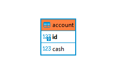

# Cборка banking

###### Версия Java
Сборка и локальный запуск проекта поддерживается на OpenJDK 11

###### Сборка проекта
* название БД, IP-адрес, логин и пароль можно менять в application.yaml
* dump базы данных в: ./banking.sql
* скриншот структуры базы данных

* команда для сборки: mvn clean package
###### Выполнять операции со счётом по соответсвующим эндпоинтам
* узнать баланс
http://localhost:8080/balance?id=1
* снять деньги
http://localhost:8080/take?id=1&cash=5
* пополнить счёт
http://localhost:8080/put?id=1&cash=51