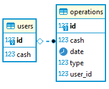

# Cборка banking

###### Версия Java
Сборка и локальный запуск проекта поддерживается на OpenJDK 11

###### Сборка проекта
* название БД, IP-адрес, логин и пароль можно менять в application.yaml
* dump базы данных в: ./banking.sql
* скриншот структуры базы данных

* команда для сборки: ``mvn clean package``
###### Выполнять операции со счётом по соответсвующим эндпоинтам
* узнать баланс
  * http://localhost:8080/balance/{id}
  * http://localhost:8080/balance/1
* снять деньги
  * http://localhost:8080/take/{id}/{cash}
  * http://localhost:8080/take/1/5
* пополнить счёт
  * http://localhost:8080/put/{id}/{cash}
  * http://localhost:8080/put/1/51
* получить все операции пользователя по id и дате
  * http://localhost:8080/all?id=1&from=2019-01-01&to=2025-01-01
  * http://localhost:8080/all?id=1&from=2012-05-05&to
  * http://localhost:8080/all?id=1&from&to=2012-05-05
  * http://localhost:8080/all?id=1&from&to